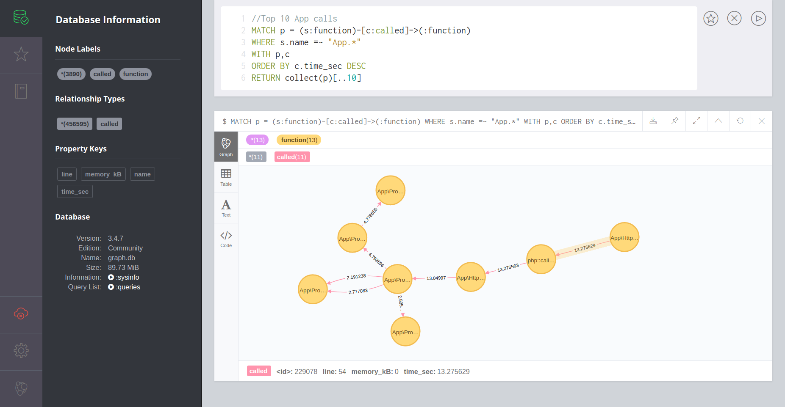

# Apollon
`Apollon` analyzes files in [cachegrind compatible format](http://valgrind.org/docs/manual/cg-manual.html), used e.g. by [xdebug profiler](https://xdebug.org/docs/profiler). The result will creates a graph database using [neo4j](https://neo4j.com/).

# Preview


# Development status
`Apollon` is still under development. For now, it supports the following features:
* `docker-compose` file to run a local neo4j database
* Parse cachegrind file and create a graph database
* Create function call nodes
* Create relationship `(:function)-[called {time_sec, memory_kB, line}]->(:function)`

# Installation 
Currently, no binary is provided. One can just install/try it by using
```bash
go get github.com/windler/Apollon
```

Start a local `neo4j`db using 
```bash
docker-compose up -d
``` 
in workspace root.

