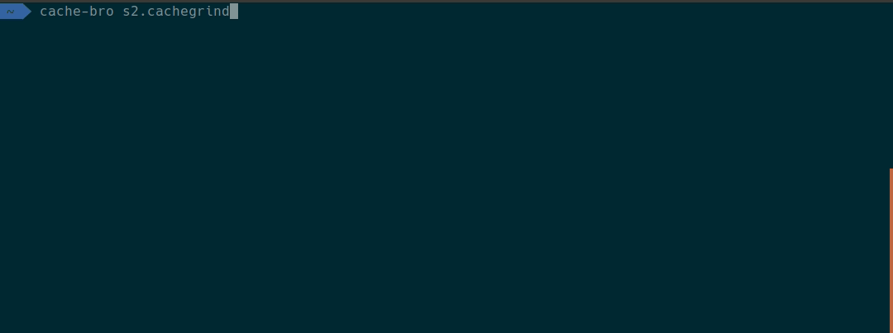

# cache-bro
`cache-bro` is an interactive GO cli app that analyzes files in [cachegrind compatible format](http://valgrind.org/docs/manual/cg-manual.html), used e.g. by [xdebug profiler](https://xdebug.org/docs/profiler). With `cache-bro` you can easily get insight into your profiling results.

# Preview


# Development status
`cache-bro` is still under development. For now, it supports the following features:
* Interactive cli
* Parse cachegrind file
* Print top n memory or cpu calls
* Modify output format defining custom go-template

# Installation 
Currently, no binary is provided. One can just install/try it by using
```bash
go get github.com/windler/cache-bro
```
as long as the first version has not been released.

# Future work
* Adding filters to include/exclude calls
* Add ability to navigate through the call tree
* Draw call graphs
